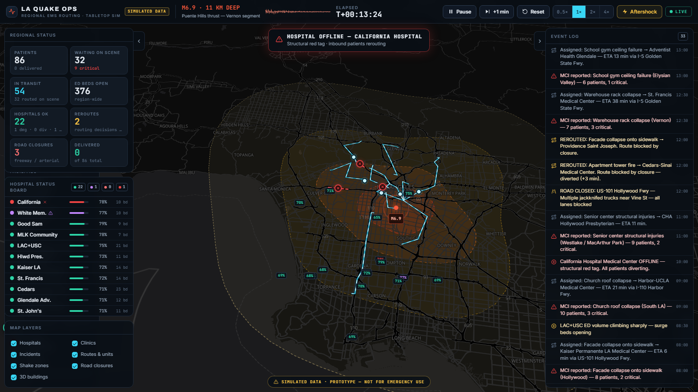
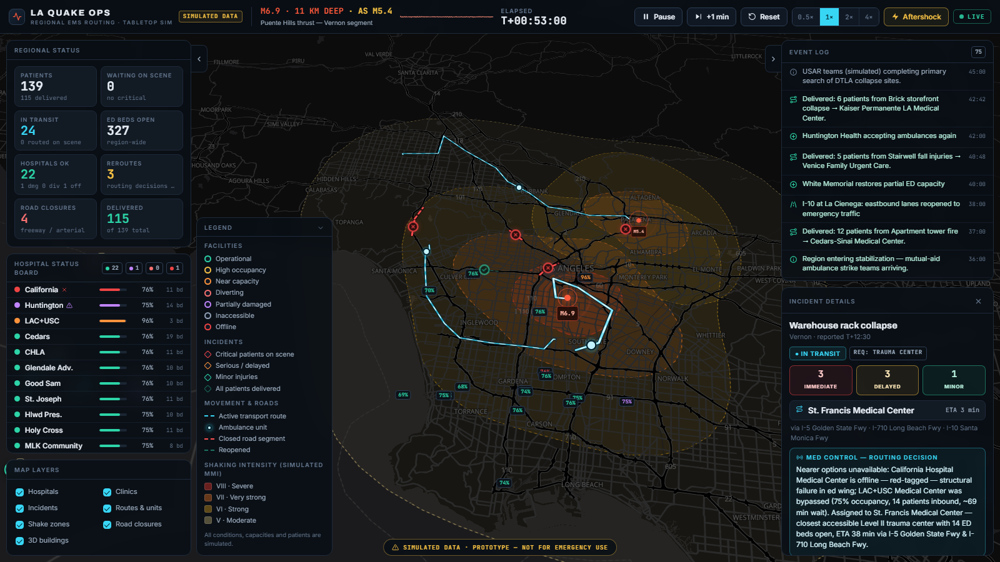
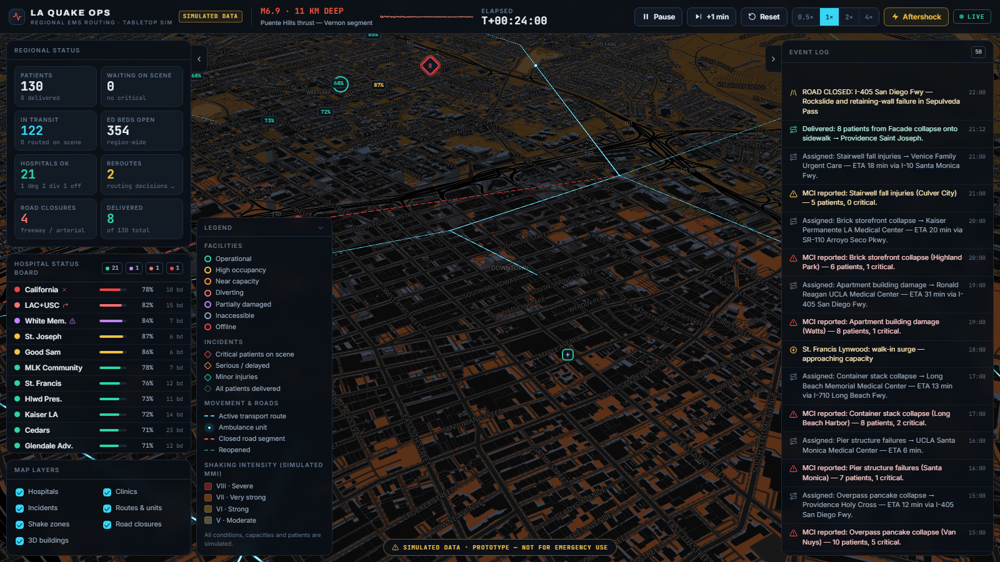

# LA Quake Ops — Earthquake Hospital-Routing Simulation (Prototype)

A map-centered emergency-operations dashboard that plays out the first 75 minutes
after a simulated **M6.9 earthquake on the Puente Hills thrust** beneath southeast
Los Angeles: mass-casualty incidents appear across the basin, hospitals report
damage and overload, freeways close, and every patient transport is routed — and
visibly *re*-routed — with a plain-English explanation of why that hospital was
chosen.

> ⚠️ **SIMULATED DATA — VISUAL PROTOTYPE.** All patient, hospital-condition,
> capacity, damage, and road data are fictional. Real hospital names and
> locations are used for geographic realism only; the urgent-care clinics are
> entirely fictional. This is not clinically validated, not affiliated with
> LA County or any agency, and must never be used for real emergency guidance.



## Quick start

```bash
npm install
npm run dev        # → http://localhost:5173
```

Open the app, read the intro card, press **Start scenario**. No API keys, no
configuration — the basemap is [OpenFreeMap](https://openfreemap.org)'s free
`dark` style (OpenMapTiles schema, © OpenStreetMap contributors), fetched at
runtime with no token.

Requirements: Node 20+, a WebGL-capable browser, network access for map tiles
(the app falls back to a plain dark canvas with all overlays if tiles are
unreachable).

## Demo script (~4 minutes at 1×)

| When | What to show |
|---|---|
| T+0 | Mainshock: shake effect, MMI zones ripple out, seismograph strip spikes, event feed starts. |
| T+2–T+9 | Incidents spawn (DTLA garage collapse, Boyle Heights gas explosion…). Click one — the **Med Control** card explains the assignment; the route hugs real freeway corridors. |
| T+5–T+6 | I-10 and I-110 close: red dashed segments with ✕ badges. |
| T+10 | **California Hospital red-tagged offline** — banner fires, inbound patients visibly reroute, feed logs each decision. |
| T+14 | LAC+USC declares trauma diversion; new trauma patients skip the closest Level I and the explanation says so. |
| T+22 | I-405 closes in Sepulveda Pass — Valley↔Westside detours. |
| T+30 | Scripted **M5.4 Pasadena aftershock**: Huntington diverts, SR-110 closes, Old Pasadena incident routes the long way around. |
| Any time | Press **⚡ Aftershock** for deterministic manual presets (Santa Monica Bay → Sylmar → Vernon). |
| T+36+ | Stabilization: I-10 reopens, hospitals recover, remaining transports deliver. |

Also try: hovering any hospital/incident/closure for a tooltip; clicking rows in
the Hospital Status Board; layer toggles (including **3D buildings** — zoom into
DTLA with a pitched camera); pause + **+1 min** stepping; speeds 0.5×–4×.




## Architecture

```
src/
  sim/            Pure-TypeScript simulation core — no DOM, fully unit-tested (76 tests)
    types.ts        Domain model (facilities, incidents, zones, closures, metrics…)
    rng.ts          Seeded mulberry32 — all randomness is deterministic
    geo.ts          Haversine, destinations, point-in-polygon, organic zone rings
    roadNetwork.ts  Hand-traced LA graph: 13 freeway corridors + ~20 arterials
    pathfinding.ts  A* with closure blocking and shake-zone cost multipliers
    facilities.ts   24 real-name hospitals + 5 fictional clinics; status derivation
    routing.ts      Candidate filtering, weighted scoring, explanation composer
    scenario.ts     Scripted deterministic timeline + manual aftershock presets
    engine.ts       Tick engine: events, walk-in surges, transports, reroutes, metrics
    store.ts        React binding (useSyncExternalStore) + rAF sim loop
  map/            MapLibre GL integration (basemap, GeoJSON overlays, DOM markers)
  ui/             Panels: top bar/seismograph, metric tiles, hospital board,
                  event feed, detail panels, legend, layer toggles, intro/alerts
```

The sim core never touches the DOM; the UI reads one state snapshot per engine
notification (throttled ~7 Hz for panels) while the map animates transports and
route dashes at full frame rate from the same state.

## Simulation behavior

- **Clock** — fixed 0.1-sim-minute quanta; 1× speed = 0.5 sim-min per real
  second (75-minute scenario ≈ 2.5 minutes). *Step* advances exactly 1 minute,
  even while paused.
- **Determinism** — the timeline is fully scripted, all geometry noise is
  seeded, and manual aftershocks follow a fixed preset sequence, so every run
  is identical (verified by tests that compare runs with different tick
  slicing).
- **Hospitals** — occupancy moves through walk-in surges (event-driven rates),
  transport deliveries, and post-stabilization discharges. Status precedence:
  offline → inaccessible → partially damaged → diverting (declared or ≥102%
  occupancy) → near capacity (≥95%) → high occupancy (≥80%) → operational.
- **Incidents** — spawn per script with triage counts (immediate/delayed/minor)
  and a required capability; after an on-scene triage delay a single batch
  transport departs and animates along its route.

## Routing assumptions

- **Network** — a stylized graph of real corridor shapes (I-5, I-10, I-105,
  I-110/SR-110, I-210, I-405, I-710, US-101, SR-91, SR-134 + major arterials).
  Post-quake speeds: freeway 72 km/h, parkway 52, arterial 36, local spur 26.
  Edges inside severe/strong shaking cost ×1.6/×1.25. Closures block edges
  entirely, so detours are real geometry, not straight lines.
- **Scoring** — ETA + 0.35·(estimated wait) + steep projected-occupancy
  pressure (including inbound patients and this load) + damage and
  capability-mismatch penalties. Clinics accept only minor-care; trauma
  requires a Level I/II center; pediatric patients prefer the pediatric trauma
  center. Diverting/full facilities are excluded unless *nothing* else is
  reachable (a med-control override, and the explanation says so).
- **The nearest hospital often loses** — every assignment names the nearer
  facilities that were rejected and why (offline, at capacity, diverting, cut
  off, bypassed under load).
- **Reroutes** — on-scene patients reroute when their facility goes offline,
  inaccessible, diverting, or full; in-transit units continue to a diverting
  facility (real-world diversion applies to new transports) but redirect from
  their current position when the destination goes offline or a closure cuts
  their route.

## Checks

```bash
npm test           # 76 Vitest tests on the sim core
npm run typecheck  # strict TypeScript
npm run lint       # ESLint 9 + typescript-eslint
npm run build      # tsc + production Vite build
```

## Map configuration

The default basemap needs **no key**. To swap:

- **CARTO dark-matter** (also key-free): change `BASEMAP_STYLE_URL` in
  `src/map/basemap.ts` to
  `https://basemaps.cartocdn.com/gl/dark-matter-gl-style/style.json`.
- **MapTiler / Mapbox** — use their style URL with your token (Mapbox also
  requires swapping `maplibre-gl` for `mapbox-gl`). Keep tokens in
  `.env.local` (`VITE_MAP_TOKEN`) — never commit secrets.
- **Google Maps** was considered and skipped: it requires per-viewer API keys
  and billing and offers less styling control for this dark ops aesthetic.

3D buildings extrude the OpenMapTiles `building` layer (`render_height`) and
appear from zoom ~12.5.

## Limitations

- The road graph is stylized (~110 nodes) — routes follow plausible corridors
  but are **not navigation-grade**, and marker positions for a few clustered
  facilities carry small pixel declutter offsets.
- One scenario; incidents transport as single batches to one destination;
  patient counts and capacities are invented for demo readability.
- No persistence, auth, dispatch/hospital integrations, or mobile layout
  (desktop-first; rails collapse below ~1000px).
- Feed/panel updates are throttled to ~7 Hz by design; the map animates at
  full frame rate.

## Attribution

Basemap tiles and styles: [OpenFreeMap](https://openfreemap.org) ·
[OpenMapTiles](https://openmaptiles.org) · © OpenStreetMap contributors.
Built with MapLibre GL JS, React, Vite, and Vitest.
